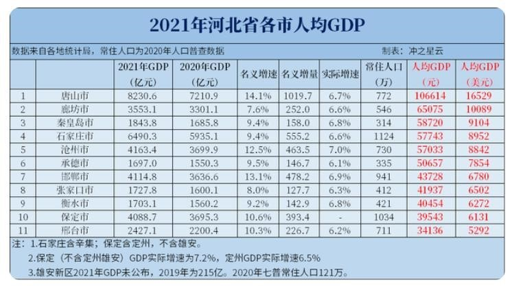
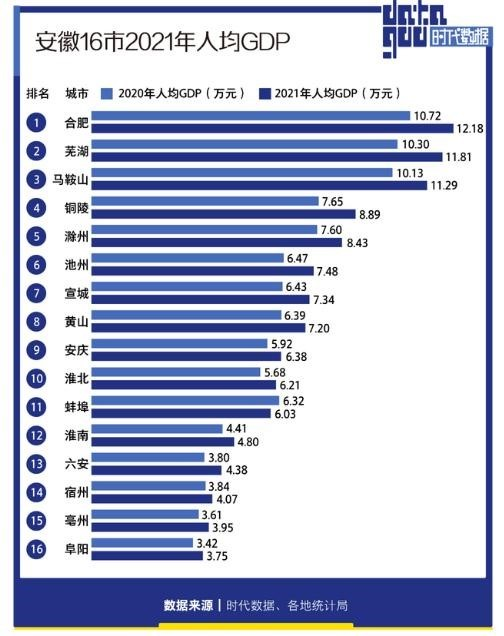
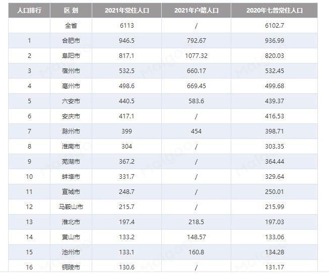
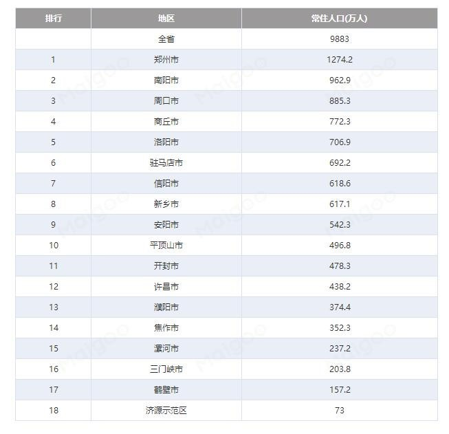
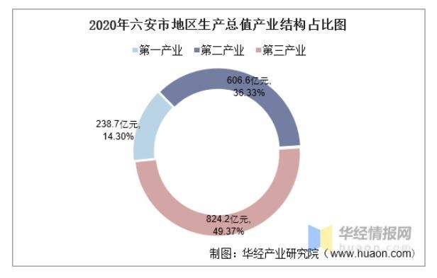
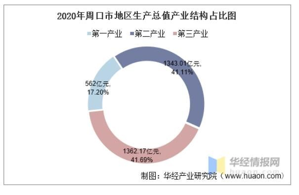
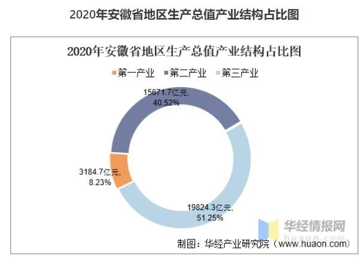

# 线索

## 小镇做题家—产地简析

::: info 作者信息
- ID：会飞的刺豚（B 站）
- 联系方式：2975830725@qq.com
:::

小镇做题家最近被大家纷纷提及，目前个人了解的三个很有名的“小镇做题家” 产地分别是河北衡水的衡水中学，安徽六安的毛坦厂中学和河南周口的郸城一高。

为什么这三个地方是“小镇做题家”的产地，我很想知道答案，所以我从以下几个方面试图探寻答案。

方向一，人均GDP

因为各个学校所在市的人口不同，计算GDP总量我觉得不合适，就从人均GDP 入手。

从以上三个图可以简单看出，河北衡水的人均GDP在河北排名倒数第三，人均 40454元；安徽六安人均GDP在安徽排名倒数第四，人均4.38万；河南周口市人均GDP在河南排名倒数第一，人均38761元。从人均GDP可以简单看出，“小镇做题家”产地的第一要素就是贫困，三个地方的人均GDP在各个省都基本处于垫底的存在，所以经济条件催生了“小镇做题家”的产生。

方向二，人口总数

一个有名的“小镇”学校，生源需求是很大的，所以当地的人口可能也是因素之一。

如果从人口总数上来看，河南周口市和安徽六安市在人口总数上占据优势，人口总量在省内排名前列，而河北衡水在人口总数上并不占据优势，人口总数排名靠后。所以按照开始的推论进行论述，人口总数在郸城一高和毛坦厂中学是成立的，但是河北衡水却不支持上述论断，所以我在想衡水是不是面向全省招生，以解决当地人口基数小的这个问题。

方向三，产业结构

三个市的产业比例几乎都是以第三产业为主，其中周口市第三产业与第二产业相对一致。而且在三个城市中，第一产业几乎都在15%左右。三个地方的第一产业占比，都高于全省平均第一产业占比。是不是可以大胆的估计一下，第一产业的占比与“小镇做题家”有很严密的关系在这三个地方。第一产业又与城镇化率息息相关，我查了第七次人口普查数据。三个市的城镇化率都显著低于省平均水平。小镇做题家的产地，一般要满足，一，当地第一产业占比较高，城镇化率低的地区；二，人口基数较大的地区；三，人均GDP较低的地区。

{2019年年末人口，衡水的常住人口城镇化率为53.2%，比上年提高1.2个百分点。

2019年年末人口，河北的常住人口城镇化率为57.62%，比上年末提高1.19个百分点。

2019年年末人口，周口市城镇化率达到44.36%。

2019年年末人口，河南居住在城镇的人口为5507.9万人，占55.43%。

2019年，六安市常住人口487.3万人，城镇化率47.09%，

2019年年末人口，安徽省常住人口城镇化率55.81%，提高1.12个百分点。
}

